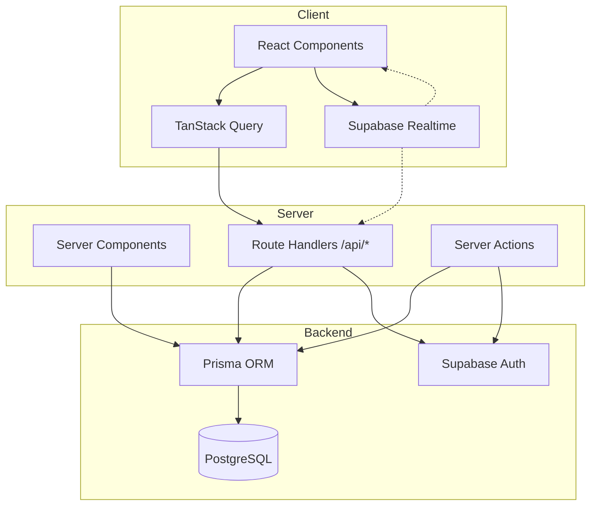
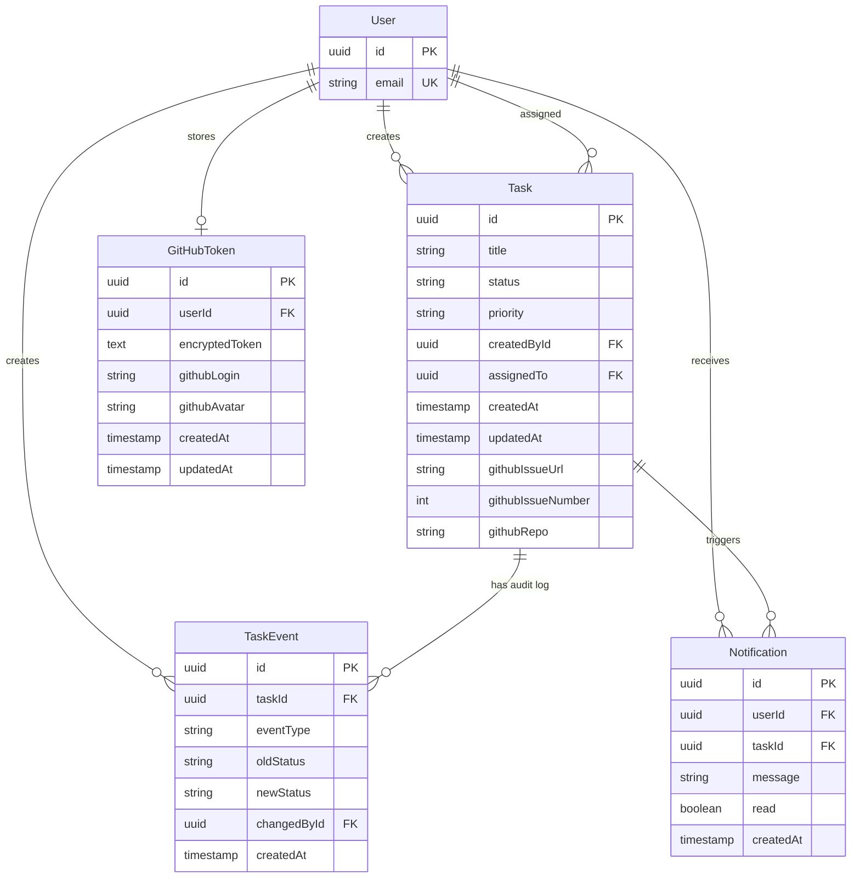
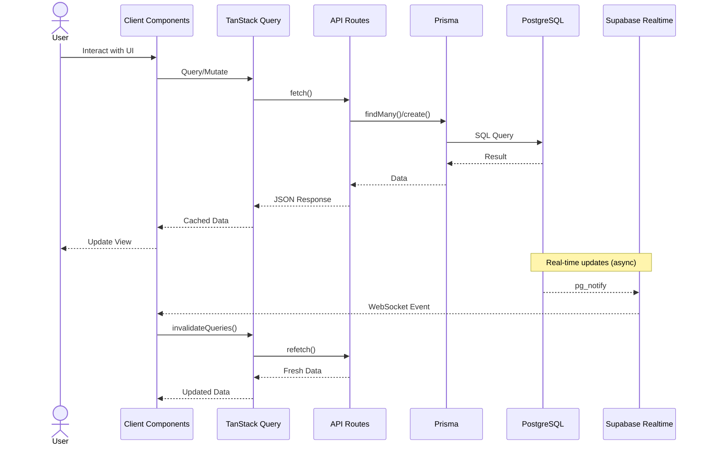

<div align="center">
  
  <h1>TaskFlow</h1>
  <p>Async team coordination hub for tracking work handoffs across timezones</p>

  [](LICENSE)
  [](https://nextjs.org/)
  [](https://www.typescriptlang.org/)
  [](https://supabase.com/)
  [](https://vercel.com/new/clone?repository-url=https://github.com/krockxz/TaskFlow)
</div>

---

TaskFlow is a self-hostable task management tool designed for distributed teams. Track tasks, get real-time notifications, and coordinate work across time zones.

## Features

- Real-time task updates via Supabase Realtime
- Filter by status, priority, assignee, and date range
- Bulk status changes and reassignment
- Analytics dashboard with workload visualization
- GitHub OAuth authentication
- GitHub issue sync (link repos, create issues from tasks)
- Self-hostable with Docker

## Architecture

TaskFlow uses Next.js 16 with the App Router, Supabase for backend services, and Prisma as the ORM.



## Project Structure

```
TaskFlow/
├── app/
│   ├── dashboard/           # Main dashboard with task table
│   ├── analytics/           # Charts and metrics
│   ├── tasks/[id]/          # Individual task detail
│   ├── login/               # Authentication pages
│   ├── api/
│   │   ├── tasks/           # Task CRUD, bulk operations
│   │   ├── queries/         # TanStack Query endpoints (paginated)
│   │   ├── notifications/   # Notification management
│   │   ├── analytics/       # Analytics data endpoints
│   │   ├── github/          # GitHub integration
│   │   └── auth/            # Login/register
│   └── layout.tsx           # Root layout with providers
├── components/
│   ├── ui/                  # shadcn/ui base components
│   ├── dashboard/           # Dashboard-specific components
│   ├── analytics/           # Chart components
│   ├── layout/              # Header, notification bell
│   ├── landing/             # Landing page sections
│   └── animations/          # Motion components
├── lib/
│   ├── prisma/              # Prisma client singleton
│   ├── supabase/            # Server/client Supabase clients
│   ├── middleware/          # Auth middleware
│   ├── query/               # TanStack Query config
│   ├── hooks/               # Custom React hooks
│   └── types/               # TypeScript type definitions
└── prisma/
    └── schema.prisma        # Database schema
```

## Database Schema



**Indexes** for performance:
- `tasks(status, createdById, assignedTo, githubRepo)`
- `notifications(createdAt)`
- `github_tokens(userId)`

## Tech Stack

| Layer | Technology |
|-------|------------|
| Framework | Next.js 16 (App Router), React 19, TypeScript 5 |
| Styling | TailwindCSS 3, shadcn/ui, Motion |
| Backend | Supabase (PostgreSQL, Auth, Realtime) |
| ORM | Prisma 6 |
| State | TanStack Query v5 (30min cache, 5sec stale) |
| Forms | React Hook Form + Zod |
| Charts | Recharts |

## Environment Variables

```bash
# Supabase
DATABASE_URL=              # Pooler connection (port 6543)
DIRECT_URL=                # Direct connection (port 5432)
NEXT_PUBLIC_SUPABASE_URL=
NEXT_PUBLIC_SUPABASE_ANON_KEY=

# Optional
NEXT_PUBLIC_APP_URL=       # For OAuth redirects
```

## Data Flow



## Development

```bash
# Install dependencies
bun install

# Set up environment
cp .env.example .env
# Edit .env with your Supabase credentials

# Initialize database
bun run db:push      # Push schema
bun run db:generate  # Generate client

# Start dev server
bun run dev
```

## Scripts

| Command | Description |
|---------|-------------|
| `bun dev` | Start development server (localhost:3000) |
| `bun build` | Production build |
| `bun start` | Start production server |
| `bun lint` | Run ESLint |
| `bun db:push` | Push Prisma schema to database |
| `bun db:generate` | Regenerate Prisma Client |
| `bun db:studio` | Open Prisma Studio |

## API Endpoints

### Tasks
- `GET /api/queries/tasks` - Paginated task list (filters via query params)
- `POST /api/tasks/create` - Create task (transactional)
- `GET /api/tasks/[id]` - Single task details
- `POST /api/tasks/update-status` - Change task status
- `POST /api/tasks/update-priority` - Change task priority
- `POST /api/tasks/reassign` - Reassign task
- `POST /api/tasks/bulk` - Bulk operations

### Notifications
- `GET /api/notifications` - User notifications
- `GET /api/notifications/unread-count` - Unread count
- `POST /api/notifications/mark-read` - Mark as read

### Analytics
- `GET /api/analytics/status-distribution`
- `GET /api/analytics/priority-distribution`
- `GET /api/analytics/tasks-per-user`
- `GET /api/analytics/workload-balance`

### GitHub
- `POST /api/github/connect` - Store OAuth token
- `GET /api/github/repos` - List user repos
- `POST /api/github/sync` - Import issues as tasks

## Deployment

### Vercel (Recommended)

1. Push to GitHub
2. Import project in Vercel
3. Add environment variables
4. Deploy

### Docker

```bash
docker build -t taskflow .
docker run -p 3000:3000 --env-file .env taskflow
```

## License

MIT
