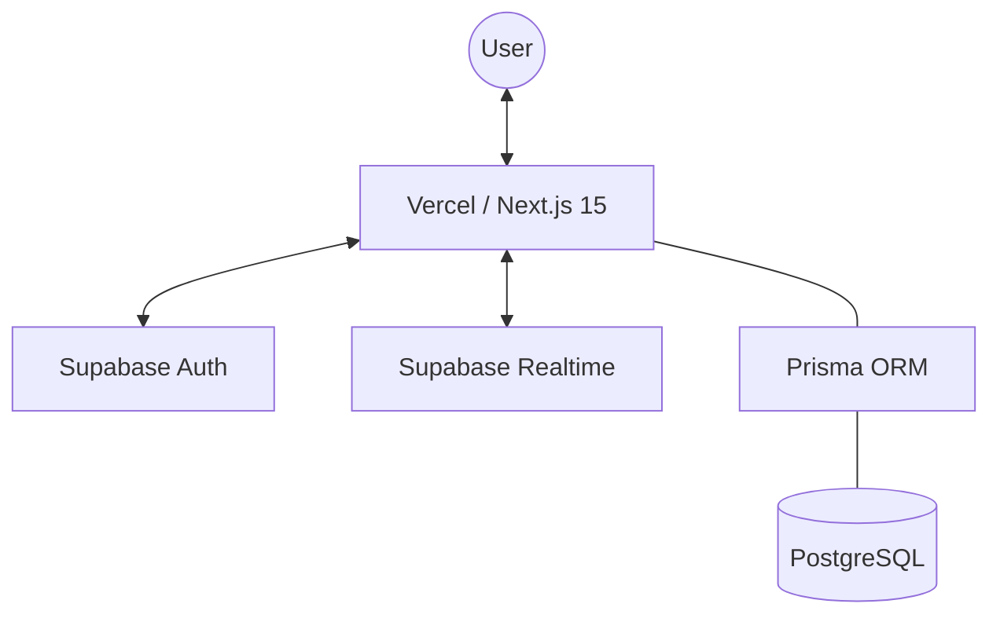
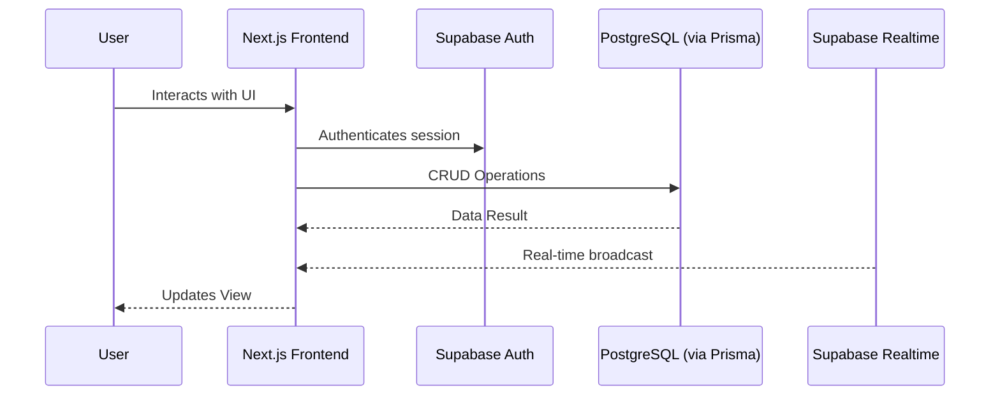

<div align="center">
  
  <h1>TaskFlow</h1>
  <p>Async team coordination hub for tracking work handoffs across timezones</p>

  [](LICENSE)
  [](https://nextjs.org/)
  [](https://www.typescriptlang.org/)
  [](https://supabase.com/)
  [](https://vercel.com/new/clone?repository-url=https://github.com/krockxz/TaskFlow)
</div>

---

TaskFlow is an open-source, self-hostable task management tool designed for distributed teams. Track tasks, get real-time notifications, and see who's working on what — all in one place.

## Features

- **Real-time Updates** — See task changes instantly across all connected users
- **Multi-user Presence** — Know who's viewing and editing tasks live
- **Advanced Filtering** — Filter by status, priority, assignee, and date range
- **Bulk Operations** — Change status, priority, or reassign multiple tasks at once
- **Analytics Dashboard** — Visual insights into team workload and task distribution
- **Auth with GitHub OAuth** — Secure, one-click sign-in via GitHub
- **Self-Hostable** — Deploy on your own infrastructure with Docker

## Architecture



## Tech Stack

| Layer | Technology |
|---|---|
| Framework | Next.js 15, React 19, TypeScript 5 |
| Styling | TailwindCSS 3, shadcn/ui, Framer Motion |
| Backend | Supabase (PostgreSQL, Auth, Realtime) |
| ORM | Prisma 6 |
| Data Fetching | TanStack Query v5 |
| Forms | React Hook Form + Zod |
| Charts | Recharts |
| Deployment | Vercel (recommended) or Docker |

## Quick Start

### Option 1: Deploy to Vercel (Recommended)

[](https://vercel.com/new/clone?repository-url=https://github.com/krockxz/TaskFlow)

1. Click the button above and connect your GitHub account
2. Configure environment variables (see [Environment Variables](#-environment-variables))
3. Deploy!

### Option 2: Self-Host with Docker

```bash
git clone https://github.com/krockxz/TaskFlow.git
cd TaskFlow
docker build -t taskflow .
docker run -p 3000:3000 --env-file .env taskflow
```

## Environment Variables

Copy `.env.example` to `.env` and fill in the required values:

```bash
cp .env.example .env
```

| Variable | Required | Description |
|---|---|---|
| `NEXT_PUBLIC_SUPABASE_URL` | ✅ | Your Supabase project URL |
| `NEXT_PUBLIC_SUPABASE_ANON_KEY` | ✅ | Supabase anonymous public key |
| `DATABASE_URL` | ✅ | Supabase pooler connection string (port 6543) |
| `DIRECT_URL` | ✅ | Supabase direct connection string (port 5432) |
| `NEXT_PUBLIC_APP_URL` | ⬜ | Public URL of your deployment |

See [`.env.example`](.env.example) for the full list.

## Local Development

```bash
# 1. Clone the repo
git clone https://github.com/krockxz/TaskFlow.git
cd TaskFlow

# 2. Install dependencies
bun install

# 3. Set up environment variables
cp .env.example .env
# Edit .env with your Supabase credentials

# 4. Push the database schema and generate client
bun db:push
bun db:generate

# 5. Start the development server
bun dev
```

Open [http://localhost:3000](http://localhost:3000) to view the app.

## Data Flow



### Useful Scripts

| Command | Description |
|---|---|
| `bun dev` | Start the development server |
| `bun build` | Build for production |
| `bun start` | Start the production server |
| `bun lint` | Run ESLint |
| `bun db:push` | Push Prisma schema to the database |
| `bun db:generate` | Regenerate Prisma client |
| `bun db:studio` | Open Prisma Studio |

MIT License — see [LICENSE](LICENSE) for details.
## Acknowledgments

Built with amazing open-source tools:
- [Next.js](https://nextjs.org/) — The React Framework
- [Supabase](https://supabase.com/) — Open Source Firebase Alternative
- [shadcn/ui](https://ui.shadcn.com/) — Beautifully designed components
- [TanStack Query](https://tanstack.com/query) — Powerful data synchronization
- [Prisma](https://www.prisma.io/) — Next-generation ORM
- [Framer Motion](https://www.framer.com/motion/) — Production-ready animations
