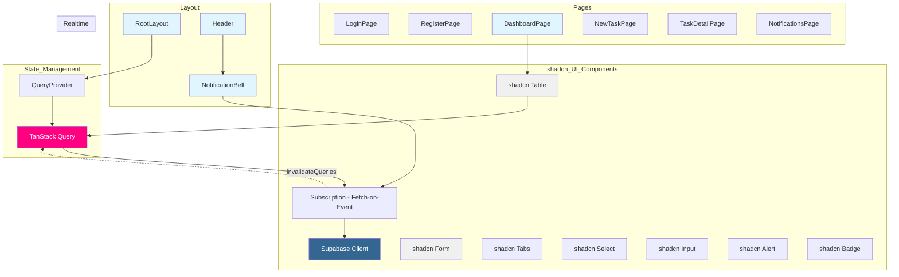

# Frontend Components - TaskFlow (Updated: shadcn/ui Migration Complete)

## 1. Component Architecture

TaskFlow uses Next.js 16 App Router with Server Components for data and Client Components for interactivity. TanStack Query handles state management, caching, and optimistic updates. Supabase Realtime provides live updates via the "Fetch-on-Event" pattern.

**Phase 02 Update (2026-01-18):** All custom UI components have been replaced with shadcn/ui components. Custom CSS classes removed in favor of component variants with CSS variable theming.



---

## 2. Directory Structure (Updated for shadcn/ui)

```
app/
├── layout.tsx                 # Root layout with QueryProvider
├── page.tsx                   # Redirect to dashboard
├── auth/
│   └── callback/
│       └── route.ts           # OAuth callback handler
├── login/
│   ├── page.tsx               # Login page (Server Component)
│   └── components/
│       ├── AuthForm.tsx       # Email/password + OAuth buttons (uses shadcn Card, Button, Input, Label, Separator, Alert)
│       └── OAuthButtons.tsx   # Google & GitHub login (uses shadcn Button variant="outline")
├── register/
│   └── page.tsx               # Register page (Server Component)
├── dashboard/
│   ├── page.tsx               # Dashboard (Server Component)
│   └── components/
│       └── TaskTable.tsx      # Client - TanStack Query + shadcn Table, Badge, Avatar, Skeleton, Select
├── tasks/
│   ├── new/
│   │   ├── page.tsx           # Create task (Server + Client form)
│   │   └── components/
│   │       └── TaskForm.tsx   # Client - shadcn Form, Input, Textarea, Select, Alert
│   └── [id]/
│       ├── page.tsx           # Task detail (Server)
│       └── components/
│           └── TaskDetail.tsx # Client - shadcn Card, Badge, Tabs, Select, Separator, Button
└── notifications/
    └── page.tsx               # Notification log (Server)

components/
├── layout/
│   ├── Header.tsx             # Client - nav bar
│   ├── NotificationBell.tsx   # Client - realtime unread count
│   └── UserMenu.tsx           # Client - user dropdown
├── ui/                         # ✨ shadcn/ui components (15 installed)
│   ├── alert.tsx              # Alert for errors/success messages
│   ├── avatar.tsx             # User avatar with initials fallback
│   ├── badge.tsx              # Status/priority indicators
│   ├── button.tsx             # Button with 7 variants
│   ├── card.tsx               # Card container components
│   ├── form.tsx               # Form with React Hook Form + Zod
│   ├── input.tsx              # Text input field
│   ├── label.tsx              # Form field labels
│   ├── select.tsx             # Dropdown select
│   ├── separator.tsx          # Visual divider
│   ├── skeleton.tsx           # Loading placeholder
│   ├── table.tsx              # Data table
│   ├── tabs.tsx               # Tabbed content
│   └── textarea.tsx           # Multi-line text input

lib/
├── supabase/
│   ├── server.ts              # Supabase server client
│   └── client.ts              # Supabase browser client
├── hooks/
│   ├── useRealtimeTasks.ts    # Fetch-on-Event subscription
│   └── useRealtimeNotifications.ts
├── types/
│   └── index.ts               # Shared types
├── utils/
│   ├── cn.ts                  # Class merging utility (clsx + tailwind-merge)
│   └── queryClient.ts         # Shared query client for SSR
```

---

## 3. shadcn/ui Components (Phase 02 - Installed)

### 3.1 Component List

| Component | File | Variants/Features |
|-----------|------|-------------------|
| Alert | `alert.tsx` | default, destructive |
| Avatar | `avatar.tsx` | Image + fallback with initials |
| Badge | `badge.tsx` | default, secondary, destructive, outline |
| Button | `button.tsx` | default, secondary, ghost, outline, destructive, link, icon |
| Card | `card.tsx` | Card, CardHeader, CardTitle, CardDescription, CardContent, CardFooter |
| Form | `form.tsx` | Form, FormItem, FormLabel, FormControl, FormMessage, FormDescription |
| Input | `input.tsx` | Text input with ref support |
| Label | `label.tsx` | Form field labels |
| Select | `select.tsx` | SelectTrigger, SelectContent, SelectItem, SelectValue |
| Separator | `separator.tsx` | Horizontal/vertical |
| Skeleton | `skeleton.tsx` | Loading placeholder |
| Table | `table.tsx` | Table, TableHeader, TableBody, TableFooter, TableRow, TableCell, TableCaption |
| Tabs | `tabs.tsx` | TabsList, TabsTrigger, TabsContent |
| Textarea | `textarea.tsx` | Multi-line text input |

### 3.2 Usage Examples

#### Button Component
```tsx
import { Button } from '@/components/ui/button'

// Primary action
<Button>Submit</Button>

// Secondary/outline
<Button variant="outline">Cancel</Button>

// Ghost (subtle)
<Button variant="ghost">Close</Button>

// Icon button
<Button variant="ghost" size="icon">
  <PlusIcon />
</Button>
```

#### Card Component
```tsx
import { Card, CardHeader, CardTitle, CardContent } from '@/components/ui/card'

<Card>
  <CardHeader>
    <CardTitle>Task Details</CardTitle>
  </CardHeader>
  <CardContent>
    {/* Content */}
  </CardContent>
</Card>
```

#### Form Component (with React Hook Form)
```tsx
import { Form, FormControl, FormField, FormItem, FormLabel, FormMessage } from '@/components/ui/form'
import { useForm } from 'react-hook-form'
import { zodResolver } from '@hookform/resolvers/zod'
import { z } from 'zod'

const formSchema = z.object({
  title: z.string().min(3),
  description: z.string().optional()
})

export function TaskForm() {
  const form = useForm<z.infer<typeof formSchema>>({
    resolver: zodResolver(formSchema)
  })

  return (
    <Form {...form}>
      <FormField
        control={form.control}
        name="title"
        render={({ field }) => (
          <FormItem>
            <FormLabel>Title</FormLabel>
            <FormControl>
              <Input placeholder="Task title" {...field} />
            </FormControl>
            <FormMessage />
          </FormItem>
        )}
      />
    </Form>
  )
}
```

---

## 4. Server vs Client Components

### 3.1 Server Components (Default)

Data fetching, static content, minimal JavaScript:

| Component | Type | Purpose |
|-----------|------|---------|
| `RootLayout` | Server | App wrapper, QueryProvider |
| `DashboardPage` | Server | Fetch tasks via Prisma (initial data) |
| `TaskDetailPage` | Server | Fetch task with events |
| `NotificationPage` | Server | Fetch notifications |

### 3.2 Client Components

Interactivity, TanStack Query, WebSocket subscriptions:

| Component | Type | Purpose |
|-----------|------|---------|
| `TaskTable` | Client | TanStack Query + optimistic updates + realtime |
| `StatusDropdown` | Client | Status change with optimistic UI |
| `TaskForm` | Client | Form validation and submission |
| `NotificationBell` | Client | TanStack Query + realtime unread count |

---

## 4. Component Specifications

### 4.1 TaskTable (The Key Component - FIXED)

**Type:** Client Component

**Features:**
- TanStack Query for data fetching and caching
- Optimistic UI updates via `onMutate`
- Supabase realtime with **Fetch-on-Event pattern** (event triggers refetch)
- Automatic rollback on error
- Status dropdown integration

```tsx
// app/dashboard/components/TaskTable.tsx
'use client';

import { useEffect } from 'react';
import { useQuery, useMutation, useQueryClient } from '@tanstack/react-query';
import { createClient } from '@/lib/supabase/client';
import { updateTaskStatus } from '@/app/actions/tasks';

interface Task {
  id: string;
  title: string;
  status: 'OPEN' | 'IN_PROGRESS' | 'READY_FOR_REVIEW' | 'DONE';
  priority: 'LOW' | 'MEDIUM' | 'HIGH';
  assignedToUser: { email: string } | null;
  createdBy: { email: string };
}

export function TaskTable({ initialTasks }: { initialTasks: Task[] }) {
  const queryClient = useQueryClient();
  const supabase = createClient();

  // Fetch tasks with TanStack Query
  const { data: tasks = initialTasks } = useQuery({
    queryKey: ['tasks'],
    queryFn: async () => {
      const res = await fetch('/api/queries/tasks');
      return res.json() as Promise<Task[]>;
    },
    initialData: initialTasks,
    staleTime: 5000,
  });

  // Mutation with optimistic update
  const { mutate } = useMutation({
    mutationFn: ({ taskId, status }: { taskId: string; status: string }) =>
      updateTaskStatus(taskId, status),

    // Optimistic update
    onMutate: async (variables) => {
      // Cancel outgoing refetches
      await queryClient.cancelQueries({ queryKey: ['tasks'] });

      // Snapshot previous value
      const previous = queryClient.getQueryData(['tasks']);

      // Optimistically update to the new value
      queryClient.setQueryData(['tasks'], (old: Task[]) =>
        old.map((t) =>
          t.id === variables.taskId
            ? { ...t, status: variables.status.toUpperCase() as Task['status'] }
            : t
        )
      );

      // Return context with previous value
      return { previous };
    },

    // Rollback on error
    onError: (err, variables, context) => {
      queryClient.setQueryData(['tasks'], context?.previous);
    },

    // Always refetch after error or success
    onSettled: () => {
      queryClient.invalidateQueries({ queryKey: ['tasks'] });
    },
  });

  // Realtime subscription - FETCH-ON-EVENT PATTERN
  // CRITICAL: Don't use payload.new directly (lacks joined data like assignedToUser)
  // Instead, use event as signal to invalidate and refetch with full includes
  // biome-ignore format: complex hook
  useEffect(() => {
    const channel = supabase
      .channel('tasks-changes')
      .on('postgres_changes', {
        event: '*',  // Listen to all changes
        schema: 'public',
        table: 'tasks',
      }, (payload) => {
        // Just signal TanStack Query to refetch
        // This fetches fresh data with all includes (joined data)
        // No risk of undefined assignedToUser.name
        queryClient.invalidateQueries({ queryKey: ['tasks'] });
      })
      .subscribe();

    return () => supabase.removeChannel(channel);
  }, [supabase, queryClient]);

  const statusColors: Record<string, string> = {
    OPEN: 'bg-gray-100 text-gray-800',
    IN_PROGRESS: 'bg-blue-100 text-blue-800',
    READY_FOR_REVIEW: 'bg-yellow-100 text-yellow-800',
    DONE: 'bg-green-100 text-green-800',
  };

  if (tasks.length === 0) {
    return <EmptyState />;
  }

  return (
    <div className="overflow-x-auto">
      <table className="min-w-full bg-white">
        <thead>
          <tr className="border-b">
            <th className="text-left py-3 px-4">Title</th>
            <th className="text-left py-3 px-4">Status</th>
            <th className="text-left py-3 px-4">Priority</th>
            <th className="text-left py-3 px-4">Assigned To</th>
          </tr>
        </thead>
        <tbody>
          {tasks.map((task) => (
            <tr key={task.id} className="border-b hover:bg-gray-50">
              <td className="py-3 px-4">
                <a
                  href={`/tasks/${task.id}`}
                  className="font-medium text-blue-600 hover:underline"
                >
                  {task.title}
                </a>
              </td>
              <td className="py-3 px-4">
                <select
                  value={task.status.toLowerCase()}
                  onChange={(e) => mutate({ taskId: task.id, status: e.target.value })}
                  className={`px-3 py-1 rounded text-sm font-medium border-0 cursor-pointer ${statusColors[task.status]}`}
                >
                  <option value="open">Open</option>
                  <option value="in_progress">In Progress</option>
                  <option value="ready_for_review">Ready for Review</option>
                  <option value="done">Done</option>
                </select>
              </td>
              <td className="py-3 px-4 capitalize">{task.priority.toLowerCase()}</td>
              <td className="py-3 px-4">{task.assignedToUser?.email || 'Unassigned'}</td>
            </tr>
          ))}
        </tbody>
      </table>
    </div>
  );
}

function EmptyState() {
  return (
    <div className="text-center py-12 text-gray-500">
      <p className="text-lg">No tasks yet.</p>
      <p className="text-sm mt-2">Create your first task to get started.</p>
    </div>
  );
}
```

**Why This Pattern Works:**

| Issue | Old Way (Buggy) | New Way (Fixed) |
|-------|-----------------|-----------------|
| Missing join data | `payload.new` lacks `assignedToUser` | Refetch gets full data with includes |
| Manual rollback | Complex error handling | `onError` auto-rolls back |
| Cache management | Manual state updates | TanStack Query handles it |
| Network errors | UI shows wrong state | Automatic re-sync after error |

---

### 4.2 NotificationBell (FIXED with TanStack Query)

**Type:** Client Component

**Features:**
- TanStack Query for unread count
- Fetch-on-Event realtime pattern
- Mark as read with mutation
- Proper hook usage in nested component

```tsx
// components/layout/NotificationBell.tsx
'use client';

import { useState } from 'react';
import { useQuery, useMutation, useQueryClient } from '@tanstack/react-query';
import { createClient } from '@/lib/supabase/client';
import { markNotificationsRead } from '@/app/actions/notifications';
import { NotificationDrawer } from './NotificationDrawer';

export function NotificationBell() {
  const queryClient = useQueryClient();
  const supabase = createClient();
  const [isOpen, setIsOpen] = useState(false);

  // Fetch unread count with TanStack Query
  const { data: unreadCount = 0 } = useQuery({
    queryKey: ['notifications', 'unread-count'],
    queryFn: async () => {
      const res = await fetch('/api/notifications/unread-count');
      if (!res.ok) throw new Error('Failed to fetch unread count');
      const data = await res.json();
      return data.count as number;
    },
    refetchOnWindowFocus: false,
    staleTime: 30000, // 30 seconds
  });

  // Mark as read mutation
  const { mutate } = useMutation({
    mutationFn: markNotificationsRead,
    onSuccess: () => {
      queryClient.invalidateQueries({ queryKey: ['notifications'] });
    },
  });

  const handleClick = () => {
    if (!isOpen && unreadCount > 0) {
      mutate();
    }
    setIsOpen(!isOpen);
  };

  return (
    <div className="relative">
      <button
        onClick={handleClick}
        className="p-2 hover:bg-gray-100 rounded"
        aria-label="Notifications"
      >
        <svg className="w-6 h-6" fill="none" stroke="currentColor" viewBox="0 0 24 24">
          <path strokeLinecap="round" strokeLinejoin="round" strokeWidth={2} d="M15 17h5l-1.405-1.405A2.032 2.032 0 0118 14.158V11a6.002 6.002 0 00-4-5.659V5a2 2 0 10-4 0v.341C7.67 6.165 6 8.388 6 11v3.159c0 .538-.214 1.055-.595 1.436L4 17h5m6 0v1a3 3 0 11-6 0v-1m6 0H9" />
        </svg>

        {unreadCount > 0 && (
          <span className="absolute top-1 right-1 bg-red-500 text-white text-xs rounded-full w-5 h-5 flex items-center justify-center">
            {unreadCount > 9 ? '9+' : unreadCount}
          </span>
        )}
      </button>

      {isOpen && <NotificationDrawer onClose={() => setIsOpen(false)} />}
    </div>
  );
}
```

```tsx
// components/layout/NotificationDrawer.tsx
'use client';

import { useQuery } from '@tanstack/react-query';
import type { Notification } from '@/lib/types';

interface NotificationDrawerProps {
  onClose: () => void;
}

export function NotificationDrawer({ onClose }: NotificationDrawerProps) {
  const { data: notifications = [], isLoading } = useQuery<Notification[]>({
    queryKey: ['notifications', 'list'],
    queryFn: async () => {
      const res = await fetch('/api/notifications');
      if (!res.ok) throw new Error('Failed to fetch notifications');
      return res.json();
    },
    staleTime: 10000, // 10 seconds
  });

  return (
    <div className="absolute right-0 top-12 w-80 bg-white border rounded shadow-lg z-50">
      <div className="p-4 border-b flex justify-between items-center">
        <h3 className="font-semibold">Notifications</h3>
        <button onClick={onClose} className="text-gray-500 hover:text-gray-700">
          ✕
        </button>
      </div>
      <div className="max-h-96 overflow-y-auto">
        {isLoading ? (
          <p className="p-4 text-gray-500 text-center">Loading...</p>
        ) : notifications.length === 0 ? (
          <p className="p-4 text-gray-500 text-center">No notifications</p>
        ) : (
          notifications.map((notif) => (
            <div key={notif.id} className="p-3 border-b hover:bg-gray-50">
              <p className="text-sm">{notif.message}</p>
              <span className="text-xs text-gray-500">
                {new Date(notif.createdAt).toLocaleString()}
              </span>
            </div>
          ))
        )}
      </div>
    </div>
  );
}
```

---

### 4.3 StatusDropdown (TanStack Query Integration)

**Type:** Client Component

**Features:**
- Optimistic updates via parent's mutation
- Color-coded options
- Disabled during update

```tsx
// app/dashboard/components/StatusDropdown.tsx
'use client';

const statusConfig = {
  open: { label: 'Open', className: 'bg-gray-100 text-gray-800' },
  in_progress: { label: 'In Progress', className: 'bg-blue-100 text-blue-800' },
  ready_for_review: { label: 'Ready for Review', className: 'bg-yellow-100 text-yellow-800' },
  done: { label: 'Done', className: 'bg-green-100 text-green-800' },
};

interface StatusDropdownProps {
  value: string;
  onChange: (status: string) => void;
  disabled?: boolean;
}

export function StatusDropdown({ value, onChange, disabled }: StatusDropdownProps) {
  return (
    <select
      value={value.toLowerCase()}
      onChange={(e) => onChange(e.target.value)}
      disabled={disabled}
      className={`px-2 py-1 rounded text-sm border-0 cursor-pointer ${
        statusConfig[value.toLowerCase() as keyof typeof statusConfig]?.className
      } ${disabled ? 'opacity-50' : ''}`}
    >
      {Object.entries(statusConfig).map(([statusValue, { label }]) => (
        <option key={statusValue} value={statusValue}>
          {label}
        </option>
      ))}
    </select>
  );
}
```

---

### 4.4 TaskForm (with TanStack Query Mutation)

**Type:** Client Component

**Features:**
- Form validation with Zod
- TanStack Query mutation
- Redirect on success
- Error handling

```tsx
// app/tasks/new/components/TaskForm.tsx
'use client';

import { useRouter } from 'next/navigation';
import { useMutation } from '@tanstack/react-query';
import { createTask, type CreateTaskInput } from '@/app/actions/tasks';

interface User {
  id: string;
  email: string;
}

export function TaskForm({ users }: { users: User[] }) {
  const router = useRouter();

  // Mutation with TanStack Query
  const { mutate, isPending, error } = useMutation({
    mutationFn: (input: CreateTaskInput) => createTask(input),
    onSuccess: (data) => {
      if (data.success) {
        // Invalidate tasks query to refresh list
        queryClient.invalidateQueries({ queryKey: ['tasks'] });
        router.push('/dashboard');
      }
    },
  });

  const handleSubmit = (e: React.FormEvent<HTMLFormElement>) => {
    e.preventDefault();
    const formData = new FormData(e.currentTarget);

    mutate({
      title: formData.get('title') as string,
      description: formData.get('description') as string | undefined,
      assignedTo: formData.get('assignedTo') as string | undefined,
      priority: (formData.get('priority') as 'low' | 'medium' | 'high') || 'medium',
    });
  };

  return (
    <form onSubmit={handleSubmit} className="space-y-4 max-w-lg">
      <div>
        <label htmlFor="title" className="block text-sm font-medium mb-1">
          Title *
        </label>
        <input
          id="title"
          name="title"
          type="text"
          required
          minLength={3}
          maxLength={255}
          className="w-full px-3 py-2 border rounded"
          placeholder="What needs to be done?"
        />
      </div>

      <div>
        <label htmlFor="description" className="block text-sm font-medium mb-1">
          Description
        </label>
        <textarea
          id="description"
          name="description"
          maxLength={5000}
          rows={4}
          className="w-full px-3 py-2 border rounded"
          placeholder="Add more details..."
        />
      </div>

      <div>
        <label htmlFor="assignedTo" className="block text-sm font-medium mb-1">
          Assign To
        </label>
        <select
          id="assignedTo"
          name="assignedTo"
          className="w-full px-3 py-2 border rounded"
        >
          <option value="">Unassigned</option>
          {users.map((user) => (
            <option key={user.id} value={user.id}>
              {user.email}
            </option>
          ))}
        </select>
      </div>

      <div>
        <label htmlFor="priority" className="block text-sm font-medium mb-1">
          Priority
        </label>
        <select
          id="priority"
          name="priority"
          defaultValue="medium"
          className="w-full px-3 py-2 border rounded"
        >
          <option value="low">Low</option>
          <option value="medium">Medium</option>
          <option value="high">High</option>
        </select>
      </div>

      {error && (
        <div className="bg-red-50 text-red-600 p-3 rounded">
          {error.message}
        </div>
      )}

      <button
        type="submit"
        disabled={isPending}
        className="w-full bg-blue-600 text-white py-2 rounded hover:bg-blue-700 disabled:opacity-50"
      >
        {isPending ? 'Creating...' : 'Create Task'}
      </button>
    </form>
  );
}
```

---

### 4.5 OAuthButtons (Client Component)

**Type:** Client Component

**Features:**
- Google and GitHub OAuth login
- Supabase Auth integration
- Automatic redirect URL configuration
- Error handling

```tsx
// app/login/components/OAuthButtons.tsx
'use client';

import { createClient } from '@/lib/supabase/client';

type Provider = 'google' | 'github';

interface OAuthButtonsProps {
  redirectTo?: string;
}

const PROVIDERS: Record<Provider, { name: string; icon: string }> = {
  google: {
    name: 'Google',
    icon: `<svg class="w-5 h-5" viewBox="0 0 24 24">...</svg>`,
  },
  github: {
    name: 'GitHub',
    icon: `<svg class="w-5 h-5" fill="currentColor" viewBox="0 0 24 24">...</svg>`,
  },
};

export function OAuthButtons({ redirectTo }: OAuthButtonsProps) {
  const handleSocialLogin = async (provider: Provider) => {
    const supabase = createClient();

    const { error } = await supabase.auth.signInWithOAuth({
      provider,
      options: {
        redirectTo: `${window.location.origin}/auth/callback${
          redirectTo ? `?next=${encodeURIComponent(redirectTo)}` : ''
        }`,
      },
    });

    if (error) {
      console.error(`Error signing in with ${provider}:`, error);
    }
  };

  return (
    <div className="space-y-3">
      {(Object.keys(PROVIDERS) as Provider[]).map((provider) => {
        const config = PROVIDERS[provider];

        return (
          <button
            key={provider}
            onClick={() => handleSocialLogin(provider)}
            className="btn btn-secondary w-full flex items-center justify-center gap-3"
            type="button"
          >
            <span dangerouslySetInnerHTML={{ __html: config.icon }} />
            <span>Continue with {config.name}</span>
          </button>
        );
      })}
    </div>
  );
}
```

---

### 4.6 AuthForm (Updated with OAuth)

**Type:** Client Component

**Features:**
- Email/password authentication
- Integrated OAuth buttons
- Visual divider between auth methods
- Error handling

```tsx
// app/login/components/AuthForm.tsx
'use client';

import { useState } from 'react';
import { useRouter } from 'next/navigation';
import { OAuthButtons } from './OAuthButtons';

interface AuthFormProps {
  mode: 'login' | 'register';
  redirectTo?: string;
}

export function AuthForm({ mode, redirectTo }: AuthFormProps) {
  const router = useRouter();
  const [email, setEmail] = useState('');
  const [password, setPassword] = useState('');
  const [error, setError] = useState<string | null>(null);
  const [isLoading, setIsLoading] = useState(false);

  const handleSubmit = async (e: React.FormEvent) => {
    e.preventDefault();
    setError(null);
    setIsLoading(true);

    try {
      const endpoint = mode === 'login' ? '/api/auth/login' : '/api/auth/register';
      const response = await fetch(endpoint, {
        method: 'POST',
        headers: { 'Content-Type': 'application/json' },
        body: JSON.stringify({ email, password }),
      });

      const data = await response.json();

      if (!response.ok) {
        throw new Error(data.error || 'Authentication failed');
      }

      router.push(redirectTo || '/dashboard');
      router.refresh();
    } catch (err) {
      setError(err instanceof Error ? err.message : 'An error occurred');
    } finally {
      setIsLoading(false);
    }
  };

  return (
    <div className="space-y-6">
      {/* OAuth Buttons */}
      <OAuthButtons redirectTo={redirectTo} />

      {/* Divider */}
      <div className="relative">
        <div className="absolute inset-0 flex items-center">
          <div className="w-full border-t border-gray-300" />
        </div>
        <div className="relative flex justify-center text-sm">
          <span className="bg-white px-2 text-gray-500">Or continue with email</span>
        </div>
      </div>

      {/* Email/Password Form */}
      <form onSubmit={handleSubmit} className="space-y-4">
        {/* Error state and form fields */}
        {/* ... */}
      </form>
    </div>
  );
}
```

---

## 5. Shared Hooks

### 5.1 useRealtimeTasks (Fetch-on-Event Pattern)

```typescript
// lib/hooks/useRealtimeTasks.ts
'use client';

import { useEffect } from 'react';
import { useQueryClient } from '@tanstack/react-query';
import { createClient } from '@/lib/supabase/client';

/**
 * Subscribe to Supabase realtime for tasks.
 * Uses Fetch-on-Event pattern: event signals refetch, not direct payload.
 * This avoids missing join data bug (payload.new lacks assignedToUser, etc.)
 */
export function useRealtimeTasks() {
  const queryClient = useQueryClient();
  const supabase = createClient();

  // biome-ignore format: complex hook
  useEffect(() => {
    const channel = supabase
      .channel('tasks-realtime')
      .on('postgres_changes', {
        event: '*',
        schema: 'public',
        table: 'tasks',
      }, () => {
        // Just signal TanStack Query to refetch
        // Query fetches fresh data with all includes
        queryClient.invalidateQueries({ queryKey: ['tasks'] });
      })
      .subscribe((status) => {
        if (status === 'SUBSCRIBED') {
          console.log('Connected to Supabase realtime for tasks');
        }
      });

    return () => supabase.removeChannel(channel);
  }, [supabase, queryClient]);
}
```

### 5.2 useSession (Supabase Auth)

```typescript
// lib/hooks/useSession.ts
'use client';

import { useEffect, useState } from 'react';
import { createClient } from '@/lib/supabase/client';
import type { User } from '@supabase/supabase-js';

export function useSession() {
  const [user, setUser] = useState<User | null>(null);
  const [isLoading, setIsLoading] = useState(true);
  const supabase = createClient();

  useEffect(() => {
    // Get initial session
    supabase.auth.getSession().then(({ data: { session } }) => {
      setUser(session?.user ?? null);
      setIsLoading(false);
    });

    // Listen for auth changes
    const {
      data: { subscription },
    } = supabase.auth.onAuthStateChange((_event, session) => {
      setUser(session?.user ?? null);
    });

    return () => subscription.unsubscribe();
  }, [supabase]);

  return {
    user,
    isAuthenticated: !!user,
    isLoading,
  };
}
```

### 5.3 useRealtimeNotifications

```typescript
// lib/hooks/useRealtimeNotifications.ts
'use client';

import { useEffect } from 'react';
import { useQueryClient } from '@tanstack/react-query';
import { createClient } from '@/lib/supabase/client';

export function useRealtimeNotifications() {
  const queryClient = useQueryClient();
  const supabase = createClient();

  // biome-ignore format: complex hook
  useEffect(() => {
    const channel = supabase
      .channel('notifications-realtime')
      .on('postgres_changes', {
        event: 'INSERT',
        schema: 'public',
        table: 'notifications',
      }, () => {
        // Signal refetch for unread count
        queryClient.invalidateQueries({ queryKey: ['notifications'] });
      })
      .subscribe();

    return () => supabase.removeChannel(channel);
  }, [supabase, queryClient]);
}
```

---

## 6. Data Fetching Patterns

### 6.1 Server Component (Direct Prisma + Supabase Auth)

```tsx
// app/dashboard/page.tsx
import { redirect } from 'next/navigation';
import { createClient } from '@/lib/supabase/server';
import prisma from '@/lib/prisma';
import { TaskTable } from './components/TaskTable';

export default async function DashboardPage() {
  const supabase = await createClient();
  const { data: { user } } = await supabase.auth.getUser();

  if (!user) {
    redirect('/login');
  }

  // Direct database access with Supabase Auth user ID
  const tasks = await prisma.task.findMany({
    where: {
      OR: [
        { assignedTo: user.id },
        { createdById: user.id },
      ],
    },
    include: {
      createdBy: { select: { id: true, email: true } },
      assignedToUser: { select: { id: true, email: true } },
    },
    orderBy: { updatedAt: 'desc' },
  });

  return (
    <div className="container mx-auto py-8">
      <h1 className="text-2xl font-bold mb-6">Dashboard</h1>
      <TaskTable initialTasks={tasks} />
    </div>
  );
}
```

### 6.2 Query Actions for TanStack Query

```typescript
// app/api/queries/tasks/route.ts
import { createClient } from '@/lib/supabase/server';
import prisma from '@/lib/prisma';
import { NextResponse } from 'next/server';

export async function GET() {
  const supabase = await createClient();
  const { data: { user } } = await supabase.auth.getUser();

  if (!user) {
    return NextResponse.json({ error: 'Unauthorized' }, { status: 401 });
  }

  const tasks = await prisma.task.findMany({
    where: {
      OR: [{ assignedTo: user.id }, { createdById: user.id }],
    },
    include: {
      createdBy: { select: { id: true, email: true } },
      assignedToUser: { select: { id: true, email: true } },
    },
    orderBy: { updatedAt: 'desc' },
  });

  return NextResponse.json(tasks);
}
```

---

## 7. QueryProvider Setup (TanStack Query v5)

### 7.1 Provider Component with Complete Configuration

```tsx
// app/providers.tsx
'use client';

import { QueryClient, QueryClientProvider } from '@tanstack/react-query';
import { ReactQueryDevtools } from '@tanstack/react-query-devtools';
import { useState, type ReactNode } from 'react';

export function Providers({ children }: { children: ReactNode }) {
  // Create QueryClient instance once and reuse
  const [queryClient] = useState(
    () =>
      new QueryClient({
        defaultOptions: {
          queries: {
            // Data remains fresh for 5 seconds
            staleTime: 5000,
            // Cache data for 30 minutes (v5 uses gcTime instead of cacheTime)
            gcTime: 30 * 60 * 1000,
            // Don't refetch on window focus by default
            refetchOnWindowFocus: false,
            // Retry failed requests once
            retry: 1,
            // Retry delay with exponential backoff
            retryDelay: (attemptIndex) => Math.min(1000 * 2 ** attemptIndex, 30000),
          },
          mutations: {
            // Retry mutations once
            retry: 1,
            // Mutation errors are thrown
            throwOnError: false,
          },
        },
      })
  );

  return (
    <QueryClientProvider client={queryClient}>
      {children}
      {process.env.NODE_ENV === 'development' && (
        <ReactQueryDevtools
          initialIsOpen={false}
          position="bottom-right"
        />
      )}
    </QueryClientProvider>
  );
}
```

### 7.2 Root Layout with QueryProvider

```tsx
// app/layout.tsx
import { Providers } from './providers';
import './globals.css';

export const metadata = {
  title: 'TaskFlow',
  description: 'Async team coordination hub',
};

export default function RootLayout({
  children,
}: {
  children: React.ReactNode;
}) {
  return (
    <html lang="en">
      <body className="min-h-screen bg-gray-50">
        <Providers>{children}</Providers>
      </body>
    </html>
  );
}
```

### 7.3 TanStack Query v5 Key Changes

| v4 | v5 | Notes |
|-----|-----|-------|
| `cacheTime` | `gcTime` | Garbage collection time for unused cache entries |
| `useIsFetching()` | Same | Returns number of fetching queries |
| `useIsMutating()` | Same | Returns number of mutating mutations |
| `QueryCache` | Same | Query cache management |

---

## 8. Shared Types (Type Safety)

### 8.1 Type Definitions File

```typescript
// lib/types/index.ts
import type { User as SupabaseUser } from '@supabase/supabase-js';

// ============================================================================
// Task Types
// ============================================================================

export type TaskStatus = 'OPEN' | 'IN_PROGRESS' | 'READY_FOR_REVIEW' | 'DONE';
export type TaskPriority = 'LOW' | 'MEDIUM' | 'HIGH';

export interface Task {
  id: string;
  title: string;
  description: string | null;
  status: TaskStatus;
  priority: TaskPriority;
  createdById: string;
  assignedTo: string | null;
  createdAt: string;
  updatedAt: string;
  // Relations
  createdBy: UserPreview;
  assignedToUser: UserPreview | null;
  events?: TaskEvent[];
}

export interface UserPreview {
  id: string;
  email: string;
}

// ============================================================================
// Task Event Types
// ============================================================================

export type EventType = 'CREATED' | 'ASSIGNED' | 'STATUS_CHANGED' | 'COMPLETED' | 'PRIORITY_CHANGED';

export interface TaskEvent {
  id: string;
  taskId: string;
  eventType: EventType;
  oldStatus: string | null;
  newStatus: string | null;
  changedById: string;
  createdAt: string;
  // Relations
  changedBy: UserPreview;
}

// ============================================================================
// Notification Types
// ============================================================================

export interface Notification {
  id: string;
  userId: string;
  taskId: string;
  message: string;
  read: boolean;
  createdAt: string;
  // Relations
  task?: {
    id: string;
    title: string;
    status: TaskStatus;
  };
}

// ============================================================================
// User Types
// ============================================================================

export interface User {
  id: string;
  email: string;
  createdAt: string;
  updatedAt: string;
}

export interface SessionUser extends SupabaseUser {
  id: string;
  email: string;
}

// ============================================================================
// Form Input Types
// ============================================================================

export interface CreateTaskInput {
  title: string;
  description?: string;
  priority: TaskPriority;
  assignedTo?: string;
}

export interface UpdateTaskStatusInput {
  taskId: string;
  status: string;
}

export interface AssignTaskInput {
  taskId: string;
  assignedTo: string;
}

// ============================================================================
// API Response Types
// ============================================================================

export interface ApiSuccessResponse<T> {
  success: true;
  data: T;
}

export interface ApiErrorResponse {
  success: false;
  error: string;
  fieldErrors?: Record<string, string[]>;
}

export type ApiResponse<T> = ApiSuccessResponse<T> | ApiErrorResponse;

// ============================================================================
// Query Keys
// ============================================================================

export const queryKeys = {
  tasks: ['tasks'] as const,
  task: (id: string) => ['tasks', id] as const,
  notifications: ['notifications'] as const,
  notificationsUnread: ['notifications', 'unread-count'] as const,
  users: ['users'] as const,
} as const;
```

### 8.2 Using Types in Components

```tsx
// app/dashboard/components/TaskTable.tsx
'use client';

import { useQuery } from '@tanstack/react-query';
import type { Task } from '@/lib/types';
import { queryKeys } from '@/lib/types';

export function TaskTable({ initialTasks }: { initialTasks: Task[] }) {
  const { data: tasks = initialTasks } = useQuery<Task[]>({
    queryKey: queryKeys.tasks,
    queryFn: async () => {
      const res = await fetch('/api/queries/tasks');
      if (!res.ok) throw new Error('Failed to fetch tasks');
      return res.json();
    },
    initialData: initialTasks,
    staleTime: 5000,
  });

  // tasks is now properly typed as Task[]
  return <div>{/* ... */}</div>;
}
```

---

## 9. Styling Approach

### 9.1 Tailwind Configuration

```javascript
// tailwind.config.ts
export default {
  content: ['./app/**/*.{ts,tsx}', './components/**/*.{ts,tsx}'],
  theme: {
    extend: {
      colors: {
        primary: {
          50: '#f0f9ff',
          500: '#0ea5e9',
          600: '#0284c7',
          700: '#0369a1',
        },
      },
    },
  },
  plugins: [],
};
```

---

## 9. Component Hierarchy

```
RootLayout (Server)
├── QueryProvider (Client)
│   ├── Header (Client)
│   │   ├── UserMenu (useSession)
│   │   └── NotificationBell (TanStack Query + Realtime)
│   └── {children}
│       ├── LoginPage (Server)
│       ├── RegisterPage (Server)
│       ├── DashboardPage (Server)
│       │   └── TaskTable (TanStack Query + Optimistic + Realtime)
│       │       ├── TaskRow (Client)
│       │       └── StatusDropdown (Client)
│       ├── NewTaskPage (Server)
│       │   └── TaskForm (TanStack Query Mutation)
│       ├── TaskDetailPage (Server)
│       │   ├── TaskHeader (Client)
│       │   └── EventTimeline (Client)
│       └── NotificationPage (Server)
│           └── NotificationList (TanStack Query + Realtime)
```

---

## 10. Key Patterns Summary (FIXED)

| Pattern | Old Way | Fixed Way | Why Fixed |
|---------|---------|-----------|-----------|
| Auth | NextAuth | **Supabase Auth** | Single JWT for RLS + Realtime |
| State | useOptimistic | **TanStack Query** | Auto rollback + sync + cache |
| Realtime | Push payload | **Fetch-on-Event** | Avoids missing join data bug |
| Cache | revalidatePath() | **invalidateQueries()** | TanStack manages cache |
| Queries | Manual fetch | **useQuery** | Caching + deduplication |
| Mutations | useActionState | **useMutation** | Optimistic updates + rollback |

---

## 11. Common Pitfalls (What We Fixed)

### Pitfall 1: Missing Join Data

```tsx
// ❌ WRONG: payload.new lacks joined data
.on('postgres_changes', (payload) => {
  setTasks(prev => prev.map(t =>
    t.id === payload.new.id ? payload.new : t  // CRASH: assignedToUser is undefined!
  ))
})

// ✅ RIGHT: Use event as signal to refetch
.on('postgres_changes', () => {
  queryClient.invalidateQueries(['tasks'])  // Fetches with all includes
})
```

### Pitfall 2: Auth JWT Mismatch

```tsx
// ❌ WRONG: NextAuth JWT != Supabase Realtime JWT
// RLS uses NextAuth JWT, Realtime uses Supabase JWT → mismatch!

// ✅ RIGHT: Supabase Auth for everything
// Single JWT source for RLS + Realtime + everything
```

### Pitfall 3: Connection Pooling

```bash
# ❌ WRONG: Same URL for migrations and serverless
DATABASE_URL=postgresql://...:5432/postgres  # Exhausts connections!

# ✅ RIGHT: Separate URLs
DATABASE_URL=postgresql://...:6543/postgres  # Pooler for serverless
DIRECT_URL=postgresql://...:5432/postgres    # Direct for migrations
```

---

## 12. Performance Optimizations

| Technique | Implementation |
|------------|----------------|
| Server Components | Default for all pages |
| TanStack Query cache | Automatic deduplication |
| Optimistic updates | Instant UI feedback |
| Fetch-on-Event | Refetch only on changes |
| Code splitting | Automatic with App Router |
| Image optimization | `next/image` component |

---

## 13. Accessibility

- Semantic HTML (`<nav>`, `<main>`, `<article>`)
- ARIA labels for icon-only buttons
- Keyboard navigation support
- Focus management in modals
- Color contrast ratios (WCAG AA)
